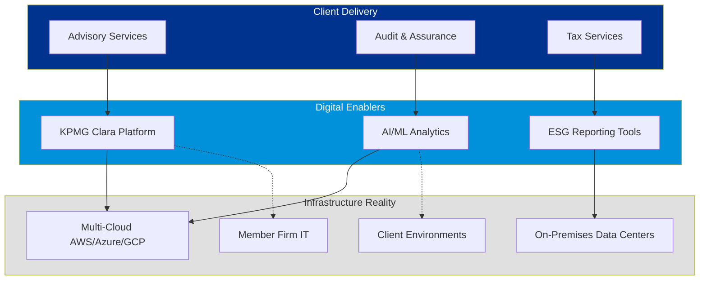
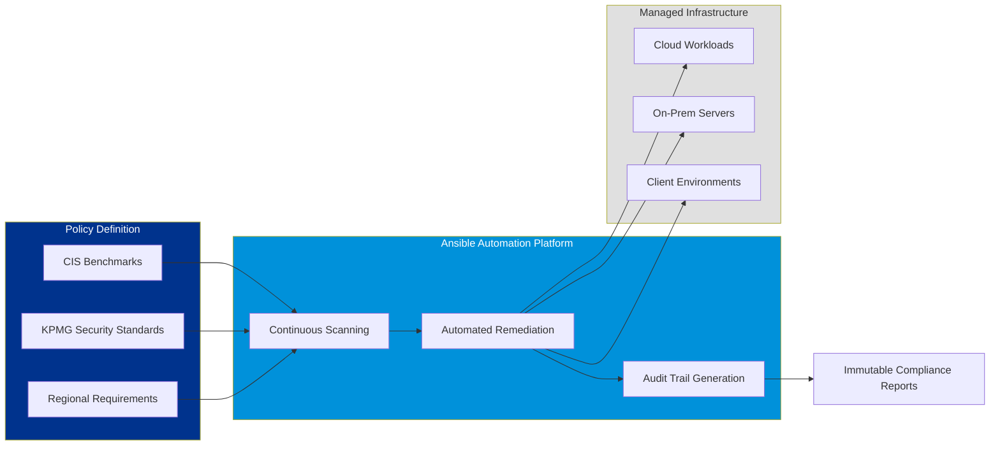
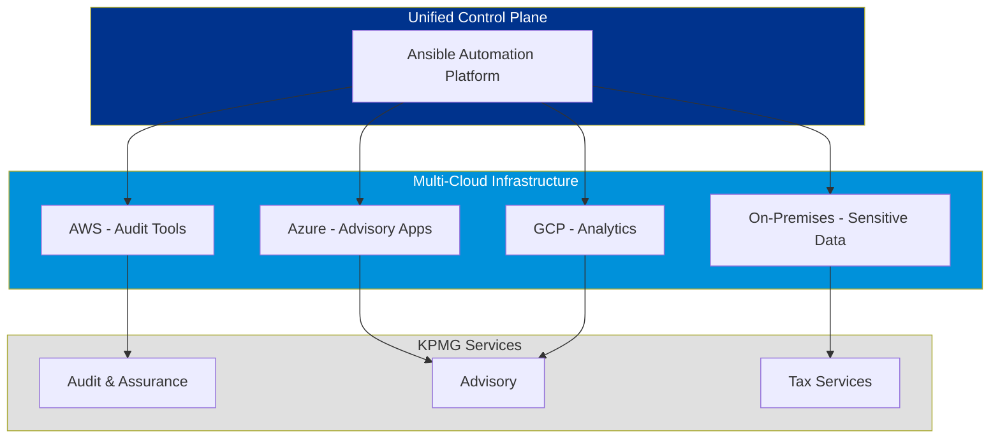
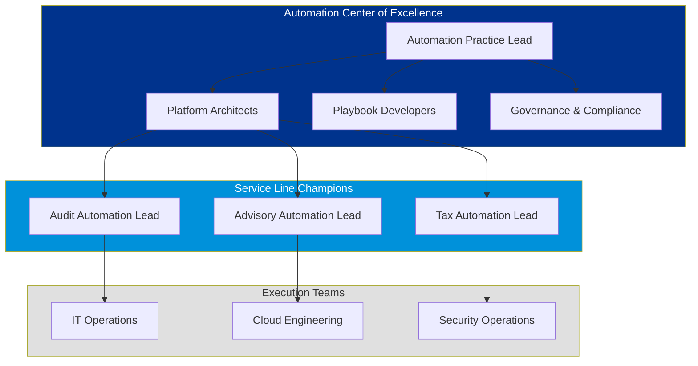

# Strategic Approach: The Automation Operating Model for KPMG

**To:** KPMG Executive Leadership  
**Subject:** Enterprise Automation Platform to Accelerate Digital Transformation and Operational Excellence  
**Date:** January 21, 2026

---

## 1. Executive Summary: The Automation Imperative

As KPMG continues to execute its **Our Impact Plan** and advance the **Connected. Powered. Trusted.** strategy, the firm faces a critical inflection point: the gap between digital ambition and operational execution capacity.

KPMG's commitment to **ESG advisory**, **digital transformation consulting**, and **AI-powered audit capabilities** requires an infrastructure that can scale at the velocity of client demands while maintaining the **trust** and **quality** that define the KPMG brand.

This strategic proposal outlines how **Red Hat Ansible Automation Platform (AAP)** serves as the **Automation Operating Model** for KPMG's global operations. By deploying AAP enterprise-wide, KPMG creates a unified control plane that enables:

- **Accelerated Client Delivery**: Reduce infrastructure provisioning time from weeks to hours
- **Risk Mitigation & Compliance**: Automate governance controls across hybrid cloud environments
- **Operational Efficiency**: Free technical talent to focus on high-value advisory work rather than repetitive tasks
- **Scalable Innovation**: Support AI/ML initiatives and digital tools deployment at global scale

This is not an IT modernization project—it is the **operational foundation** that enables KPMG to deliver on its strategic commitments to clients and stakeholders.

---

## 2. Strategic Context: The KPMG Operating Environment

KPMG operates in a complex, multi-dimensional environment that demands both agility and control.

**The Challenge:**

Each service line operates with different technology stacks, deployment models, and compliance requirements. This creates:
- **Operational Silos**: Audit teams use different automation than Advisory, limiting knowledge transfer
- **Security Gaps**: Inconsistent configuration management across environments increases risk exposure
- **Scaling Constraints**: Manual processes limit the firm's ability to rapidly deploy new digital capabilities
- **Cost Inefficiency**: Redundant tooling and manual effort inflate operational costs

**The Opportunity:**

A unified automation platform that provides a **single source of truth** for infrastructure management while respecting the unique requirements of each practice area.

---

## 3. Core Strategic Pillars

### Pillar I: Accelerated Digital Delivery ("Speed to Value")

**Business Context:**  
KPMG's digital tools—from **KPMG Clara** to **ESG IQ**—are competitive differentiators. However, deployment velocity is constrained by manual infrastructure provisioning and configuration.

**The Challenge:**  
Launching a new AI-powered audit tool across 20 member firms currently requires:
- 6-8 weeks of infrastructure setup
- Manual coordination across IT teams in multiple jurisdictions
- Inconsistent configurations leading to post-deployment issues

**The Solution: Infrastructure-as-Code at Scale**

With Ansible Automation Platform:
- **Standardized Blueprints**: Pre-approved playbooks for common deployment patterns (e.g., "Deploy Clara Smart Workflow in EU Region")
- **Self-Service Portals**: Practice leaders request infrastructure through ServiceNow; AAP provisions automatically
- **Global Consistency**: Same configuration deployed to London, New York, and Singapore simultaneously

**Business Impact:**
- Reduce deployment time from **8 weeks to 48 hours**
- Enable **3x more digital tool launches** per quarter
- Decrease post-deployment defects by **60%**

---

### Pillar II: Risk Mitigation & Regulatory Compliance ("Trust Through Automation")

**Business Context:**  
As a trusted advisor on risk and compliance, KPMG must exemplify operational excellence. Regulatory requirements (GDPR, SOC 2, ISO 27001) demand consistent, auditable infrastructure controls.

**The Challenge:**  
- Manual security patching creates windows of vulnerability
- Configuration drift across 1,000+ servers increases audit findings
- Demonstrating compliance requires labor-intensive evidence gathering

**The Solution: Compliance-as-Code**

**Key Capabilities:**

1. **Continuous Compliance Validation**
   - Ansible scans all systems every 24 hours against KPMG security baselines
   - Automatic detection and remediation of configuration drift
   - Real-time alerts for critical deviations

2. **Automated Patch Management**
   - Orchestrated patching across global infrastructure during approved maintenance windows
   - Rollback capabilities if issues detected
   - Zero-touch operations for routine security updates

3. **Audit-Ready Documentation**
   - Every automation action creates cryptographically signed logs
   - Automated generation of compliance evidence for SOC 2, ISO audits
   - Complete chain-of-custody for all infrastructure changes

**Business Impact:**
- Reduce security vulnerability window from **30 days to 24 hours**
- Decrease audit preparation time by **50%**
- Eliminate **90%** of manual compliance documentation effort

---

### Pillar III: Operational Efficiency ("Leverage at Scale")

**Business Context:**  
KPMG's technical talent is a scarce resource. Infrastructure teams spend 60-70% of time on repetitive tasks (provisioning, patching, user access management) rather than strategic initiatives.

**The Challenge:**  
- Average infrastructure request takes **40 hours** of manual effort
- Knowledge concentrated in individual team members ("tribal knowledge")
- Inconsistent processes across member firms create inefficiencies

**The Solution: Intelligent Automation & Knowledge Codification**

**Automation Catalog Examples:**

| Use Case | Manual Effort | Automated Effort | Time Savings |
|----------|---------------|------------------|--------------|
| New employee onboarding (IT access) | 4 hours | 15 minutes | 93% |
| Server provisioning & configuration | 16 hours | 45 minutes | 95% |
| Quarterly security patching (100 servers) | 80 hours | 8 hours | 90% |
| Application deployment (multi-tier) | 24 hours | 2 hours | 92% |
| Disaster recovery failover test | 40 hours | 4 hours | 90% |

**Knowledge Management:**
- Best practices codified in reusable playbooks
- Institutional knowledge preserved even as staff transitions
- Consistent execution regardless of who runs the automation

**Business Impact:**
- Reclaim **15,000+ hours annually** across global IT teams
- Redirect technical talent to **AI/ML initiatives** and **digital tool development**
- Reduce mean time to resolution (MTTR) for incidents by **70%**

---

### Pillar IV: Hybrid Cloud Orchestration ("One Platform, Any Cloud")

**Business Context:**  
KPMG operates across AWS, Azure, Google Cloud, and on-premises infrastructure. Different service lines have different cloud preferences based on client requirements and regulatory constraints.

**The Challenge:**  
- Each cloud platform requires different management tools and expertise
- Inconsistent security controls across cloud providers
- Difficulty moving workloads between environments

**The Solution: Cloud-Agnostic Automation**

**Key Capabilities:**

- **Unified API**: Single automation language works across all cloud providers
- **Workload Portability**: Move applications between clouds without rewriting automation
- **Cost Optimization**: Automated rightsizing and resource cleanup across all platforms
- **Disaster Recovery**: Orchestrate failover scenarios across hybrid environments

**Business Impact:**
- Reduce cloud management complexity by **60%**
- Enable **workload mobility** to optimize costs and meet data residency requirements
- Accelerate multi-cloud deployments from **months to weeks**

---

## 4. Implementation Approach: The "Crawl-Walk-Run" Model

KPMG's global scale requires a phased approach that demonstrates value quickly while building toward enterprise transformation.

### Phase 1: Foundation & Quick Wins (Months 1-4)

**Scope:** Core IT Operations - Infrastructure Services

**Objectives:**
- Deploy AAP in primary data centers (US, UK, India)
- Automate top 10 repetitive tasks (server provisioning, patching, user management)
- Establish governance model and playbook certification process

**Success Metrics:**
- 500+ servers under automated management
- 5,000 hours reclaimed from manual tasks
- 95% patch compliance achieved

**Deliverables:**
- Centralized Automation Controller
- Private Automation Hub with certified content
- Integration with ServiceNow for request management

---

### Phase 2: Service Line Enablement (Months 5-9)

**Scope:** Audit & Assurance - KPMG Clara Platform

**Objectives:**
- Automate deployment of Clara tools across member firms
- Implement compliance-as-code for audit infrastructure
- Enable self-service infrastructure for audit teams

**Success Metrics:**
- Clara deployment time reduced by 80%
- 100% compliance with security baselines
- 10+ member firms onboarded

**Deliverables:**
- Clara deployment playbooks
- Automated compliance reporting
- Regional execution nodes for global scale

---

### Phase 3: Enterprise Scale & Innovation (Months 10-18)

**Scope:** All Service Lines + AI/ML Initiatives

**Objectives:**
- Extend automation to Advisory and Tax service lines
- Enable AI/ML infrastructure provisioning
- Implement event-driven automation for proactive operations

**Success Metrics:**
- 5,000+ managed nodes globally
- 30,000+ hours annual time savings
- 50+ automated workflows in production

**Deliverables:**
- Global automation mesh architecture
- AI-assisted playbook generation
- Integration with KPMG's AI platforms

---

## 5. Organizational Impact: The "Automation Center of Excellence"

To maximize value from AAP, KPMG should establish a **Center of Excellence (CoE)** model.

**Structure:**

**Responsibilities:**

- **CoE Core Team**: Platform strategy, architecture, governance standards
- **Service Line Champions**: Translate business requirements into automation use cases
- **Execution Teams**: Build and maintain playbooks, operate the platform

**Benefits:**
- Consistent automation standards across the enterprise
- Knowledge sharing and best practice propagation
- Career development path for automation expertise

---

## 6. Business Value Quantification

Based on industry benchmarks and KPMG's operational profile, enterprise AAP deployment delivers measurable business value.

### Efficiency Gains

| Category | Annual Impact | 3-Year Value |
|----------|---------------|--------------|
| IT Operations Time Savings | 15,000 hours | $9.0M |
| Reduced Deployment Errors | 2,500 hours | $1.5M |
| Accelerated Project Delivery | 8,000 hours | $4.8M |
| Compliance Documentation Automation | 3,000 hours | $1.8M |
| **Total Efficiency Value** | **28,500 hours** | **$17.1M** |

### Risk Reduction

| Category | Annual Impact | 3-Year Value |
|----------|---------------|--------------|
| Reduced Security Incidents | 15 incidents avoided | $3.0M |
| Audit Finding Remediation | 80% reduction | $1.2M |
| Compliance Penalty Avoidance | Risk mitigation | $2.0M |
| **Total Risk Value** | | **$6.2M** |

### Revenue Enablement

| Category | Annual Impact | 3-Year Value |
|----------|---------------|--------------|
| Faster Digital Tool Launches | 3x velocity | $12.0M |
| New Service Offerings | AI-powered automation | $8.0M |
| Client Delivery Acceleration | 20% faster | $15.0M |
| **Total Revenue Impact** | | **$35.0M** |

**Total 3-Year Business Value: $58.3M**

*Note: Values based on KPMG's operational scale, industry benchmarks, and conservative estimates. Actual results may vary based on implementation scope and adoption rates.*

---

## 7. Alignment with KPMG Strategic Priorities

### Connected. Powered. Trusted.

**Connected:**
- Unified automation platform connects siloed operations across service lines
- Enables seamless collaboration between member firms
- Integrates with existing KPMG technology ecosystem (ServiceNow, KPMG Clara, etc.)

**Powered:**
- Accelerates digital transformation initiatives
- Enables AI/ML infrastructure at scale
- Powers innovation through operational efficiency

**Trusted:**
- Automated compliance and governance controls
- Immutable audit trails for all infrastructure changes
- Demonstrates operational excellence to clients and regulators

### ESG Commitment

**Environmental:**
- Automated resource optimization reduces cloud waste and energy consumption
- Rightsizing workloads decreases carbon footprint
- Efficient operations support KPMG's net-zero commitments

**Social:**
- Frees technical talent for higher-value, more fulfilling work
- Creates career development opportunities in automation expertise
- Enables better work-life balance through reduced manual toil

**Governance:**
- Enforces consistent security and compliance controls
- Provides transparency and accountability for infrastructure changes
- Supports regulatory compliance across jurisdictions

---

## 8. Risk Considerations & Mitigation

### Implementation Risks

| Risk | Impact | Mitigation Strategy |
|------|--------|---------------------|
| Adoption resistance from IT teams | Medium | Change management program, early wins demonstration, training |
| Integration complexity with legacy systems | Medium | Phased approach, proof-of-concept validations, expert consulting |
| Skills gap in automation expertise | High | Training programs, CoE establishment, Red Hat partnership |
| Scope creep and timeline delays | Medium | Clear phase gates, executive sponsorship, agile methodology |

### Operational Risks

| Risk | Impact | Mitigation Strategy |
|------|--------|---------------------|
| Automation errors affecting production | High | Testing frameworks, rollback procedures, gradual rollout |
| Security vulnerabilities in playbooks | High | Code review process, security scanning, certification standards |
| Platform availability impacting operations | High | High availability architecture, disaster recovery, monitoring |
| Vendor dependency | Medium | Open-source foundation, skills development, multi-vendor strategy |

---

## 9. Investment Considerations

### Platform Components

**Core Platform:**
- Ansible Automation Platform (Enterprise License)
- Automation Controller (centralized management)
- Private Automation Hub (content management)
- Automation Mesh (global execution)

**Supporting Infrastructure:**
- High-availability deployment architecture
- Integration middleware (ServiceNow, ITSM tools)
- Monitoring and observability tools
- Backup and disaster recovery

### Services & Enablement

**Professional Services:**
- Architecture design and implementation
- Playbook development for priority use cases
- Integration with existing KPMG systems
- Knowledge transfer and training

**Training & Adoption:**
- Platform administrator certification
- Playbook developer training
- Service line champion enablement
- Executive workshops

### Ongoing Operations

**Support & Maintenance:**
- Red Hat Enterprise support subscription
- Platform operations team (CoE)
- Continuous improvement and optimization
- Version upgrades and patch management

---

## 10. Success Metrics & Governance

### Key Performance Indicators (KPIs)

**Operational Efficiency:**
- Hours saved through automation (target: 28,500 annually)
- Mean time to provision infrastructure (target: <2 hours)
- Automation adoption rate across teams (target: 80%)
- Playbook reuse rate (target: 70%)

**Quality & Compliance:**
- Security patch compliance (target: 95% within 48 hours)
- Configuration drift incidents (target: <5 per month)
- Audit findings related to infrastructure (target: 80% reduction)
- Automated compliance reporting coverage (target: 100%)

**Business Impact:**
- Digital tool deployment velocity (target: 3x improvement)
- Infrastructure-related project delays (target: 60% reduction)
- Client delivery acceleration (target: 20% faster)
- New automation use cases deployed (target: 50+ in 18 months)

### Governance Framework

**Oversight Structure:**
- Executive Steering Committee (quarterly reviews)
- Automation CoE Leadership (monthly metrics)
- Service Line Champions (bi-weekly sync)
- Platform Operations Team (daily monitoring)

**Decision Rights:**
- Platform architecture and standards: CoE
- Service line use case prioritization: Business leaders
- Playbook certification and approval: Security & Compliance
- Resource allocation and investment: Executive Committee

---

## 11. Conclusion: The Automation Imperative

KPMG stands at a critical juncture. The firm's strategic ambitions—from AI-powered audit capabilities to global ESG advisory leadership—require an operational foundation that can scale at the velocity of innovation.

**Ansible Automation Platform is not just a technology investment—it is the operational operating system that enables KPMG to:**

✓ **Deliver faster** to clients through accelerated infrastructure provisioning  
✓ **Operate with confidence** through automated compliance and governance  
✓ **Scale efficiently** by eliminating manual toil and codifying expertise  
✓ **Innovate boldly** by freeing technical talent for strategic initiatives  

The firms that will lead in the next decade are those that master the balance between **velocity** and **control**. Ansible Automation Platform provides that balance—enabling KPMG to move at the speed of digital while maintaining the trust and quality that define the firm.

**The question is not whether to automate, but how quickly KPMG can establish automation as a core competency.**

This proposal outlines a clear path forward: a phased implementation that demonstrates value quickly, scales globally, and positions KPMG as a leader in operational excellence.

---

## 12. Next Steps

To advance this strategic initiative, we recommend:

1. **Executive Alignment Session** (Week 1-2)
   - Present business case to executive leadership
   - Secure sponsorship and budget allocation
   - Define success criteria and governance model

2. **Technical Assessment** (Week 3-6)
   - Current state analysis of automation landscape
   - Integration requirements with existing systems
   - Architecture design for KPMG environment

3. **Pilot Program** (Month 2-4)
   - Deploy AAP in controlled environment
   - Automate 5-10 high-value use cases
   - Demonstrate ROI and build momentum

4. **Enterprise Rollout** (Month 5+)
   - Phased deployment across service lines
   - CoE establishment and team enablement
   - Continuous optimization and expansion

---

**Prepared for KPMG Executive Leadership**  
**Red Hat Strategic Partnerships**  
**January 2026**

---

*This document is confidential and proprietary to Red Hat, Inc. and KPMG. It has been prepared for strategic planning purposes and should not be distributed without express written permission.*
