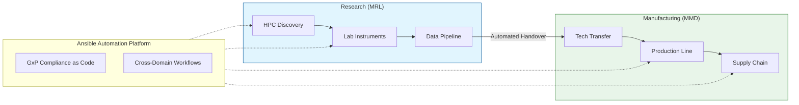
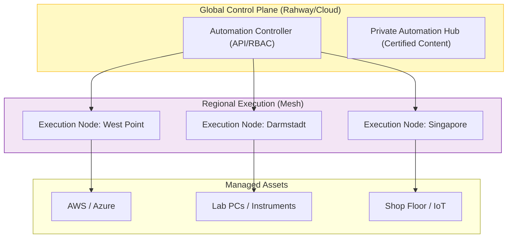

# Strategic Approach: Automating "Inventing for Life"

**To:** Sean Finnerty, Associate Vice President of Cloud and Infrastructure Technology
**Subject:** Extending Your Cloud Transformation Vision: AAP as the Automation Layer for GenAI-Powered Operations
**Date:** January 21, 2026

---

## 1. Executive Summary: The Missing Layer in Your Cloud Transformation

Sean, your recent ONUG presentation on **"Leveraging Generative AI to Accelerate Cloud Migration"** resonated deeply with the market. You articulated a vision where cloud isn't just infrastructure—it's a **catalyst for organizational transformation**.

As you drive Merck's global cloud strategy and IT transformation program, there's a critical layer that can amplify your GenAI initiatives and multi-cloud orchestration: **automation at scale**.

This proposal outlines how **Red Hat Ansible Automation Platform (AAP)** serves as the **automation operating system** beneath your cloud and AI strategy. By creating a unified control plane across AWS, Azure, on-premises infrastructure, and the factory floor, AAP enables:

- **GenAI-Powered Infrastructure Provisioning**: Accelerate cloud migration with AI-assisted playbook generation
- **GxP Compliance-as-Code**: Leverage your AWS GxP working group expertise to automate validation workflows
- **Multi-Cloud Cost Optimization**: Extract maximum value from your cloud investments through intelligent orchestration

This isn't just IT modernization—it's the automation foundation that makes your cloud transformation vision operationally executable.

---

## 2. Strategic Vision: The Automation Value Chain

We see automation not as a server utility, but as a thread that connects the entire Merck value chain.

**The Shift:**
*   **From:** Siloed automation (Shell scripts in Research, Siemens PCS7 in Manufacturing).
*   **To:** A unified control plane where a data model created in MRL can automatically provision the compliant infrastructure needed in MMD for Tech Transfer.

---

## 3. Core Strategic Pillars

### Pillar I: Accelerated GxP Compliance ("Compliance-as-Code")
Given your background on the **AWS GxP working group**, you know the tension between innovation velocity and regulatory compliance.
*   **The Challenge:** Maintaining 21 CFR Part 11 compliance often means "freezing" infrastructure, creating security debt and slowing your cloud migration initiatives.
*   **The Solution:** **Compliance-as-Code**
    *   **Continuous Validation:** Instead of manual IQ/OQ scripts, Ansible runs automated validation jobs every 24 hours across multi-cloud environments.
    *   **Drift Remediation:** If a server drifts from its validated state (e.g., a package is updated unapproved), Ansible automatically detects and fixes it, preserving the Qualified State.
    *   **Audit Trail:** Every automation run creates immutable, cryptographically signed logs—perfect for FDA inspections.

### Pillar II: "Plant-to-Patient" Edge Reliability (MMD)
Merck’s manufacturing network is a complex web of IT and OT.
*   **The Challenge:** Patching SCADA systems or lab PCs in remote sites is high-risk and labor-intensive.
*   **The Solution:** **Ansible Automation Mesh**.
    *   Deploy execution nodes directly to the factory floor.
    *   Orchestrate patches for "air-gapped" or sensitive equipment during precise maintenance windows without needing travel.

### Pillar III: R&D Self-Service (MRL) + GenAI Integration
*   **The Challenge:** Scientists need massive compute power for genomics/proteomics but get stuck filing IT tickets—slowing the innovation you're trying to accelerate.
*   **The Solution:** A "Vending Machine" for Science, **powered by GenAI**.
    *   Scientist requests a "CryoEM Environment" in ServiceNow.
    *   **GenAI analyzes the request** and generates the optimal Ansible playbook.
    *   Ansible provisions the AWS EC2 instances, mounts the S3 buckets, installs the specific molecular dynamics software, and emails the keys in <20 minutes.
    *   This aligns directly with your vision of **using GenAI to accelerate operational workflows**.

---

## 4. Technical Architecture: The "Safe" Scale

To support Merck's global footprint while respecting data sovereignty and latency.

**Key Benefit:** If the link to HQ is lost, the **Regional Nodes** continue to run critical factory automation locally, ensuring zero downtime for production batches.

---

## 5. Implementation Roadmap

### Phase 1: Foundation (Months 1-3)
*   **Focus:** IT Operations & RHEL.
*   **Goal:** Establish the "Golden Image" standard.
*   **Outcome:** 99% Patch Compliance across the server estate.

### Phase 2: The "Bridge" (Months 4-9)
*   **Focus:** MRL & Cloud.
*   **Goal:** Self-Service R&D Portals.
*   **Outcome:** Reduce scientist "wait time" by 80%.

### Phase 3: The "Factory" (Months 9-12+)
*   **Focus:** MMD & GxP.
*   **Goal:** Automated Validation.
*   **Outcome:** Reduce GxP audit preparation time by 50%.

---

## 6. Conclusion: Operationalizing Your Vision

Sean, you've articulated a compelling vision at ONUG and AWS re:Invent: **cloud as a catalyst for transformation, not just a destination**. You've championed GenAI as an accelerator for migration and value extraction.

**Ansible Automation Platform is the execution layer that makes your vision real.** It's the automation fabric that:
- Orchestrates your multi-cloud strategy across AWS, Azure, and on-premises
- Enables GenAI-powered infrastructure provisioning at scale
- Maintains GxP compliance without sacrificing velocity
- Extracts tangible business value from your cloud investments

This isn't just IT modernization—it's the **operational operating system** for the cloud transformation roadmap you're driving. Let's discuss how AAP can accelerate your next phase of innovation.