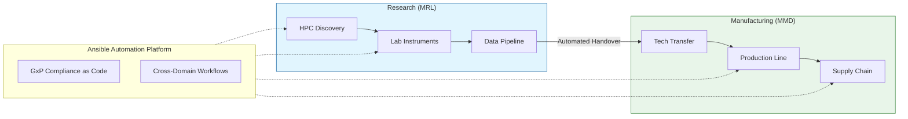
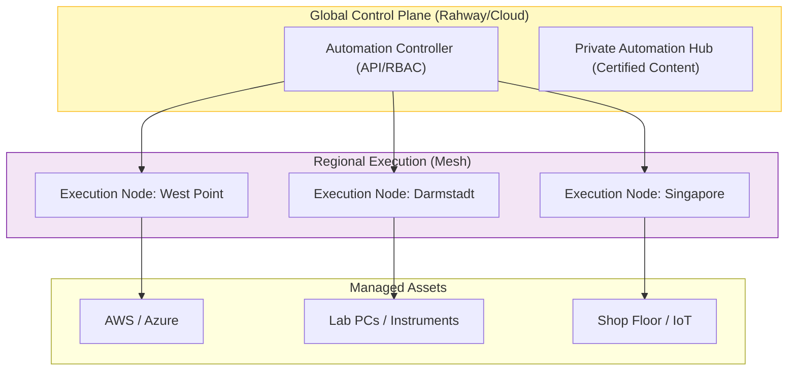

# Strategic Approach: Automating "Inventing for Life"

**To:** Merck Executive Leadership (CIO, President MMD, Head of MRL)
**Subject:** Accelerating "BioPharma 4.0" with the Ansible Automation Platform
**Date:** January 21, 2026

---

## 1. Executive Summary: The Digital Nervous System

Merck’s mission is to "Invent for Life." In the era of **BioPharma 4.0**, delivering on this mission requires more than scientific breakthrough; it requires operational velocity.

While **Merck Research Laboratories (MRL)** pushes the boundaries of discovery and **Merck Manufacturing Division (MMD)** ensures world-class supply reliability, friction often exists at the intersection of IT and Operational Technology (OT).

This proposal outlines a strategic partnership to deploy **Red Hat Ansible Automation Platform (AAP)** as the enterprise-wide "Digital Nervous System." By automating the "gray space" between Cloud, Edge, and Lab, Merck can shift from **manual GxP compliance** to **"Compliance-as-Code,"** dramatically reducing the cycle time from "Molecule to Market."

---

## 2. Strategic Vision: The Automation Value Chain

We see automation not as a server utility, but as a thread that connects the entire Merck value chain.

**The Shift:**
*   **From:** Siloed automation (Shell scripts in Research, Siemens PCS7 in Manufacturing).
*   **To:** A unified control plane where a data model created in MRL can automatically provision the compliant infrastructure needed in MMD for Tech Transfer.

---

## 3. Core Strategic Pillars

### Pillar I: Accelerated GxP Compliance ("Compliance-as-Code")
In the pharmaceutical industry, the "Qualified State" is sacred.
*   **The Challenge:** Maintaining 21 CFR Part 11 compliance often means "freezing" infrastructure, leading to security debt and slow updates.
*   **The Solution:**
    *   **Continuous Validation:** Instead of manual IO/OQ scripts, Ansible runs automated validation jobs every 24 hours.
    *   **Drift Remediation:** If a server drifts from its validated state (e.g., a package is updated unapproved), Ansible automatically detects and fixes it, preserving the Qualified State.

### Pillar II: "Plant-to-Patient" Edge Reliability (MMD)
Merck’s manufacturing network is a complex web of IT and OT.
*   **The Challenge:** Patching SCADA systems or lab PCs in remote sites is high-risk and labor-intensive.
*   **The Solution:** **Ansible Automation Mesh**.
    *   Deploy execution nodes directly to the factory floor.
    *   Orchestrate patches for "air-gapped" or sensitive equipment during precise maintenance windows without needing travel.

### Pillar III: R&D Self-Service (MRL)
*   **The Challenge:** Scientists need massive compute power for genomics/proteomics but get stuck filing IT tickets.
*   **The Solution:** A "Vending Machine" for Science.
    *   Scientist requests a "CryoEM Environment" in ServiceNow.
    *   Ansible provisions the AWS EC2 instances, mounts the S3 buckets, installs the specific molecular dynamics software, and emails the keys in <20 minutes.

---

## 4. Technical Architecture: The "Safe" Scale

To support Merck's global footprint while respecting data sovereignty and latency.

**Key Benefit:** If the link to HQ is lost, the **Regional Nodes** continue to run critical factory automation locally, ensuring zero downtime for production batches.

---

## 5. Implementation Roadmap

### Phase 1: Foundation (Months 1-3)
*   **Focus:** IT Operations & RHEL.
*   **Goal:** Establish the "Golden Image" standard.
*   **Outcome:** 99% Patch Compliance across the server estate.

### Phase 2: The "Bridge" (Months 4-9)
*   **Focus:** MRL & Cloud.
*   **Goal:** Self-Service R&D Portals.
*   **Outcome:** Reduce scientist "wait time" by 80%.

### Phase 3: The "Factory" (Months 9-12+)
*   **Focus:** MMD & GxP.
*   **Goal:** Automated Validation.
*   **Outcome:** Reduce GxP audit preparation time by 50%.

---

## 6. Conclusion
Merck has always been at the forefront of science. By adopting the Ansible Automation Platform, Merck ensures its operational capabilities match its scientific ambition. This is not just IT modernization; it is a direct enabler of the **BioPharma 4.0** vision—safer, faster, and more reliable.