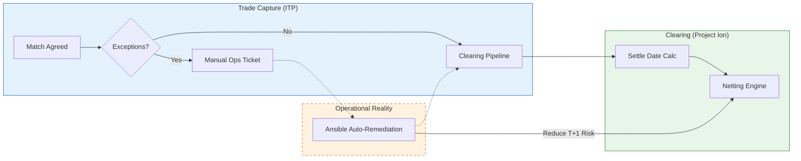
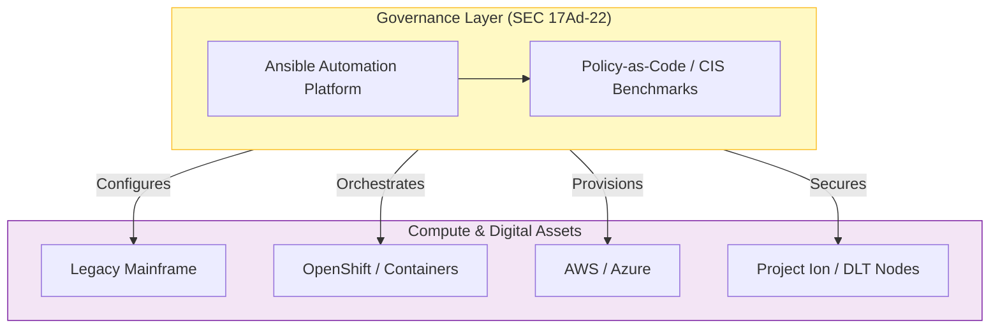

# Strategic Approach: The Automation Operating Model for DTCC

**To:** DTCC Executive Leadership
**Subject:** Scaling "100% Infrastructure as Code" to meet T+0 and Digital Asset Demands
**Date:** January 21, 2026

---

## 1. Executive Summary: The Velocity Engine

As DTCC accelerates its modernization—driven by **Project Ion**, **Digital Launchpad**, and the compression to **T+0 Settlement**—the friction between "Development Speed" and "Operational Risk" is the critical constraint.

DTCC has successfully deployed an **"Unlimited Compute"** model via Red Hat OpenShift. However, the management plane remains fragmented. To match the velocity of **Institutional Trade Processing (ITP)** and the scale of the **Endless Node** concept, DTCC requires a corresponding **"Unlimited Automation"** model.

This strategy proposes **Red Hat Ansible Automation Platform (AAP)** not just as a tool, but as the **Universal Control Plane**. By establishing an Enterprise Agreement (EA) for AAP, DTCC creates a predictable, infinite-scale automation layer that enforces **SEC Rule 17Ad-22** compliance on every asset, from the mainframe to the distributed ledger.

---

## 2. Strategic Visualization: The "Settlement Velocity" Chain

Automation is the lubricant that removes friction from the trade lifecycle, enabling the shift to real-time settlement.

**The Shift:**
*   **Current:** Exception handling (e.g., failed connectivity, capacity alerts) creates manual tickets that jeopardize settlement windows.
*   **Future:** **Event-Driven Ansible** detects infrastructure alerts in the ITP flow and self-heals the connection in milliseconds, protecting the T+0 timeline.

---

## 3. Strategic Imperative: The "Universal Control Plane"

To operationalize the **Digital Launchpad**, Engineering needs a consistent way to manage hybrid complexity without stalling for procurement or compliance reviews.

**Architectural Alignment:**
*   **The "Endless Node":** As you scale DLT nodes for Project Ion, Ansible scales linearly. An "Unlimited" license model means you never penalize innovation by having to count (and pay for) every new validator node.
*   **Hybrid Bridge:** AAP is the *only* platform that acts as the "Universal Translator," allowing a single playbook to orchestrate a workflow that touches a z/OS Mainframe job and an AWS Lambda function simultaneously.

---

## 4. Key Business Outcomes

### A. Operational Resilience (SEC Rule 17Ad-22)
*   **The Challenge:** Assessing and mitigating operational risk in a hybrid, dynamic environment.
*   **The Solution:** **Continuous Drift Control.** Ansible scans the entire estate every 24 hours. Any deviation from the "Golden State" (e.g., an unpatched vulnerability in the Settlement engine) is automatically reverted.
*   **Impact:** "Always-On" Audit Readiness. Compliance is intrinsic to the infrastructure, not an aftermarket check.

### B. Engineering Efficiency ("Day 2" Operations)
*   **The Challenge:** Terraform builds it (Day 1), but who manages it? (Day 2).
*   **The Solution:** **Full Lifecycle Management.** Ansible handles user access, secret rotation (CyberArk integration), and patching.
*   **Impact:** Zero-Touch Operations for the **Digital Launchpad**, allowing developers to focus on tokenization logic rather than server maintenance.

---

## 5. The "Unlimited" Model as Strategic Enabler

To achieve **"100% Infrastructure as Code,"** automation cannot be a scarce resource.

Adopting an **Enterprise Agreement** for Ansible—mirroring your OpenShift strategy—removes the tax on innovation.

1.  **Predictability:** Fixed cost regardless of how many DLT nodes or OpenShift clusters you deploy for Project Ion.
2.  **Agility:** New business lines (e.g., Digital Assets) spin up immediately with full security tooling. No procurement friction.
3.  **Standardization:** A single "Automation Dial Tone" for the entire enterprise, eliminating the risk of shadow IT tools.

**Conclusion:**
By standardizing on AAP as an unlimited utility, DTCC aligns its management plane with its compute plane. This is the operational foundation required to deliver the speed of **Project Ion** with the trust DTCC is known for.
